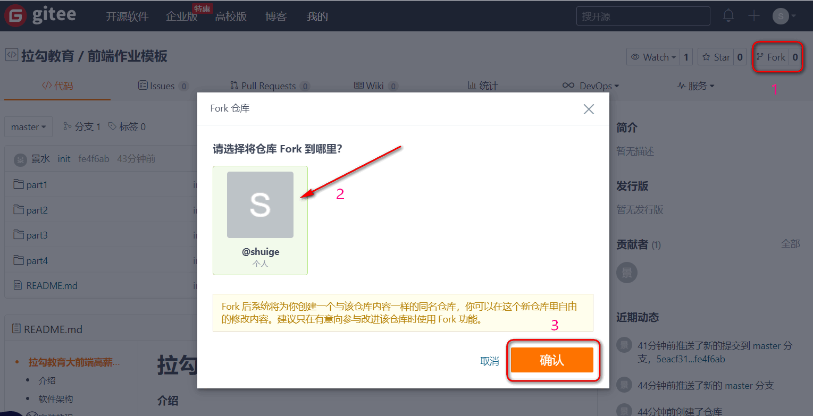
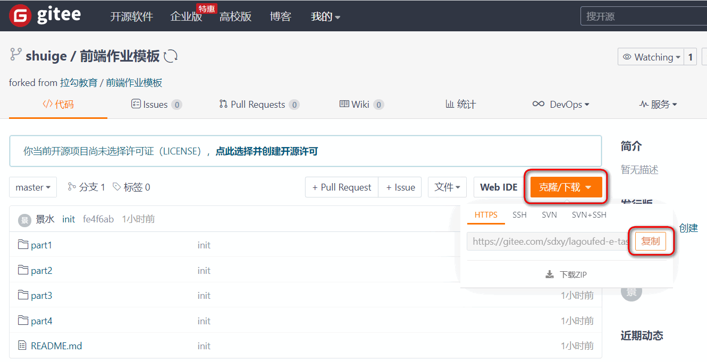
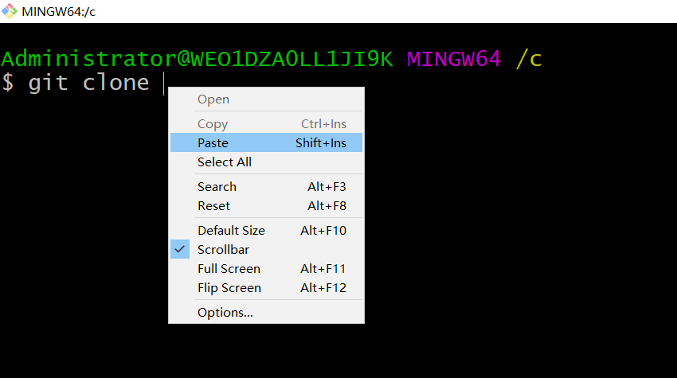
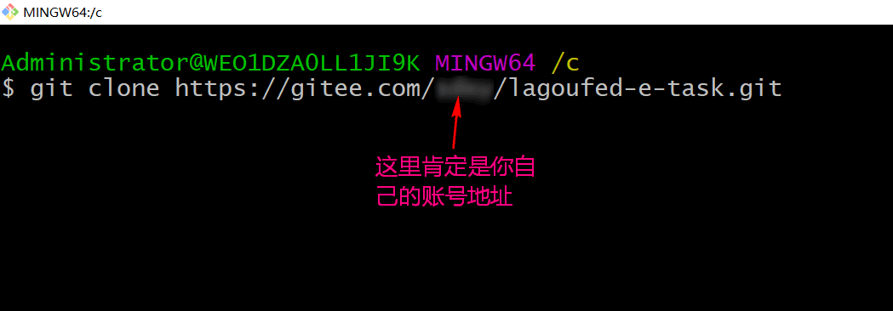

# 拉勾教育大前端高薪训练营作业

#### 推荐操作

#### 1.注册 gitee 账号  (github不稳定)

```
https://gitee.com/signup
```


#### 2.Fork 本仓库到自己账号. 并且克隆到本地.

**a) Fork 操作**

https://gitee.com/lagoufed/lagoufed-e-task



**b) 克隆到本地**








#### 3.学习完相应模块, 到本地相应文件夹下补全\书写作业.


#### 4.完成作业. 保存版本. 推送到远程仓库.

```shell
git add .
git commit -m "part1-1作业"
git push origin master
```


#### 5.提交自己仓库相应模块地址即可

