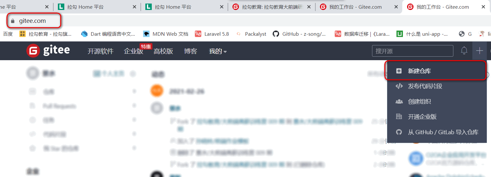
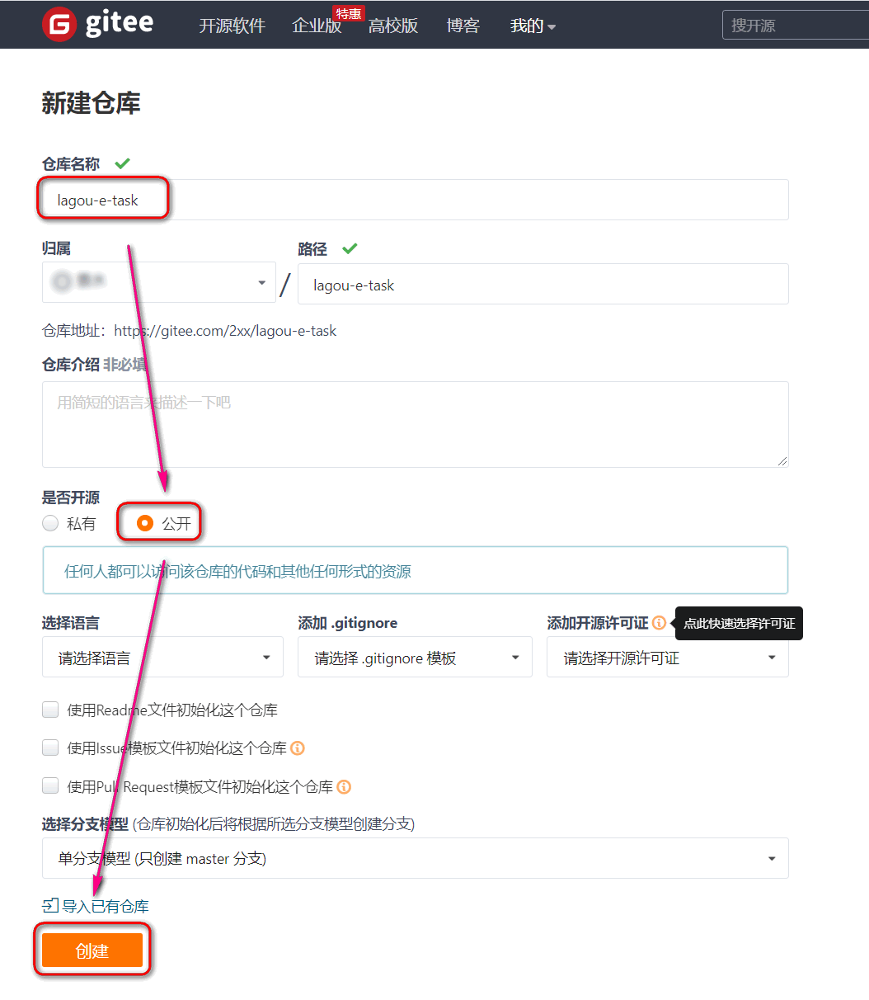
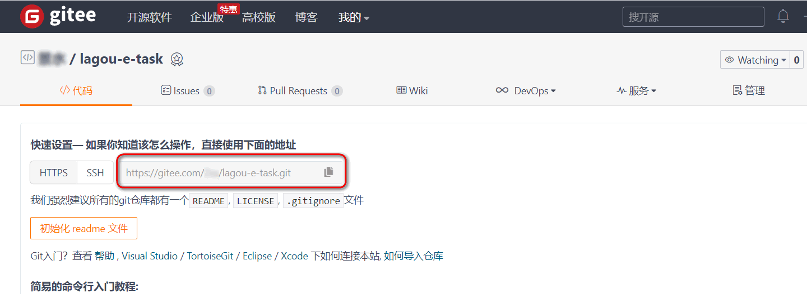
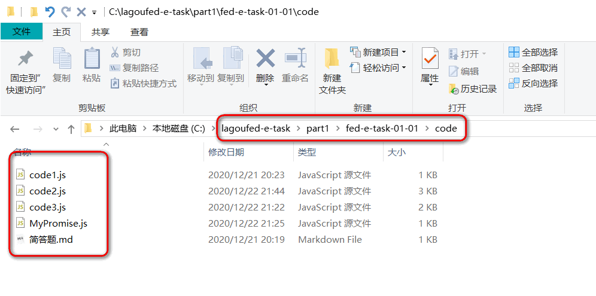
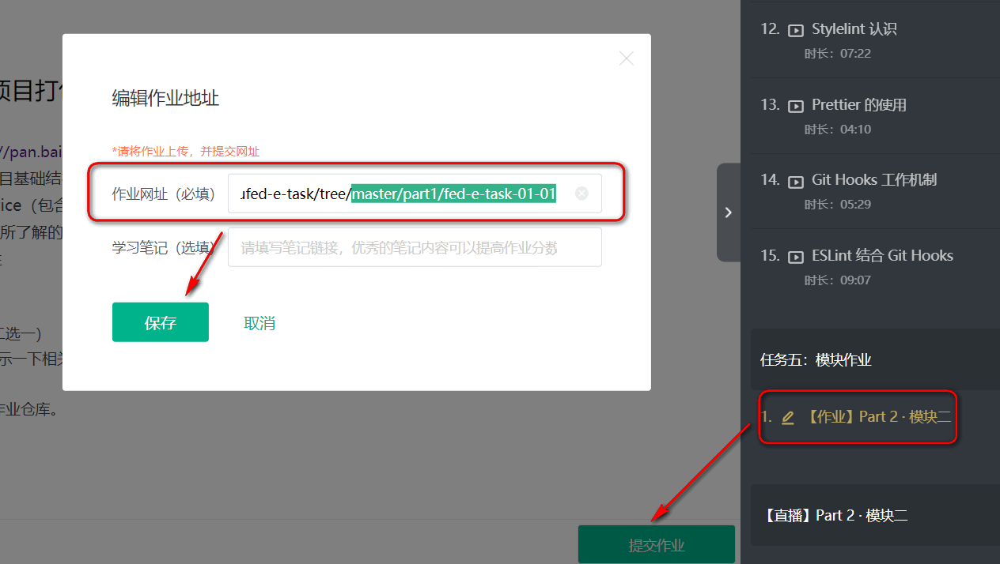

# 拉勾教育大前端高薪训练营作业

#### 推荐操作

#### 1.在 gitee 或 github 创建自己的作业仓库, 并拿到仓库地址

( **需要先注册账户**。推荐 gitee，国内相对稳定一些，github账户也可直接登录 )






**拿到仓库地址**



　

#### 2.克隆作业模板, 与新建仓库关联

```shell
# 1)克隆. 不要复制 $ 符号 
$ git clone https://gitee.com/lagoufed/lagoufed-e-task.git

# 2)进入目录
$ cd lagoufed-e-task

# 3)关联新建的空库  『后面 https://.... .git 是自己新建的仓库地址』
$ git remote set-url origin https://gitee.com/xxx/lagou-e-task.git
```

　

#### 3.学习完相应模块, 到本地相应文件夹下补全\书写作业.



　

#### 4.完成作业. 保存版本. 推送到远程仓库.

```shell
$ git add .
$ git commit -m "part1-1作业"
$ git push origin master
```

　

#### 5.提交自己仓库相应模块地址即可

