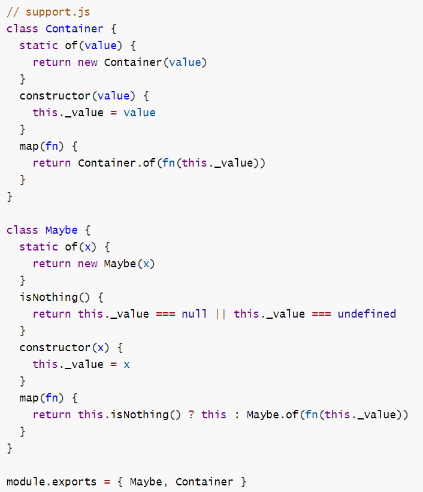

## 简答题

打开 code / 简答题.md 文件,   根据其中题目答题并保存

## 代码题

#### 准备工作

- 进入 code 目录, 
- 初始化项目生成 package.json
- 并且安装 lodash

#### 代码1

打开 code / code1.js , 按其中要求编写完成代码

#### 代码2

打开 code / code2.js 编辑补全代码, 完成4个练习要求

#### 代码3

**1) 参照下面图片敲代码, 创建 code / support.js 文件**

**2) 打开 code / code3.js 编辑补全代码, 完成4个练习要求**

#### 代码4

打开 code / MyPromise.js , 尽可能还原 Promise 中的每一个函数, 并通过注释描述思路和原理

