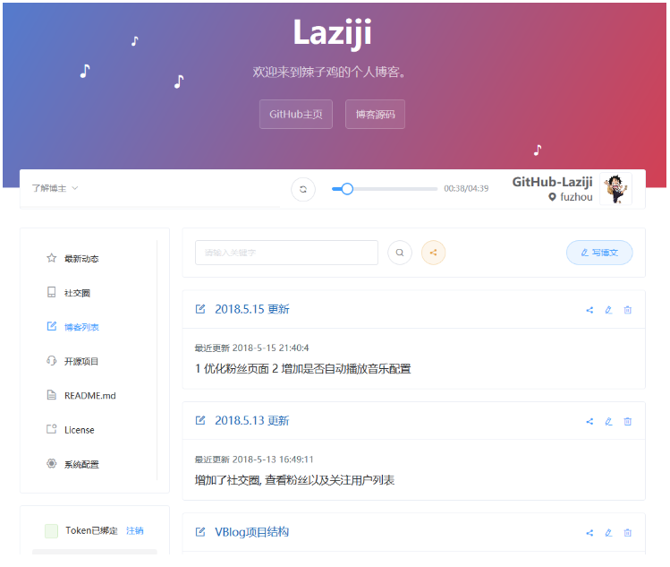
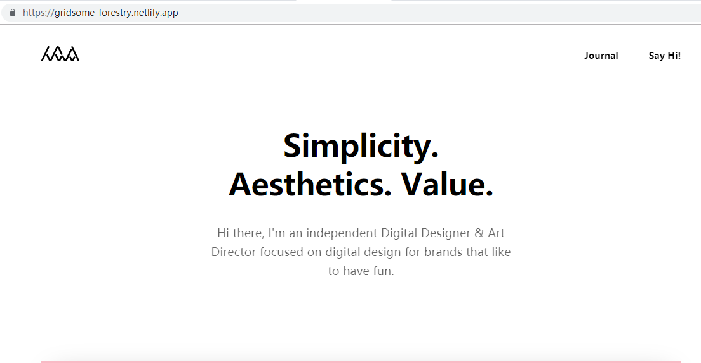

#### 作业要求:

 \- 有什么疑问找导师 

 \- 使用 Gridsome 实现下面博客首页 .\- 以下两个二选一

 \- 项目必须部署，不部署算不合格哈

 \- 没有服务器的小伙伴，联系导师购买 1毛钱 三个月，69元 一年(拉勾合作云商)

 \- 注册必须使用拉勾平台注册的手机号

  购买服务器地址   https://www.ucloud.cn/site/active/lagou.html

#### 选题1:

 \- 实现左侧前四个侧边栏的效果和内容。

 \- 项目地址 https://github-laziji.github.io/#/user/new/main

#### 选题2：

\- 项目地址 https://gridsome-forestry.netlify.app/

