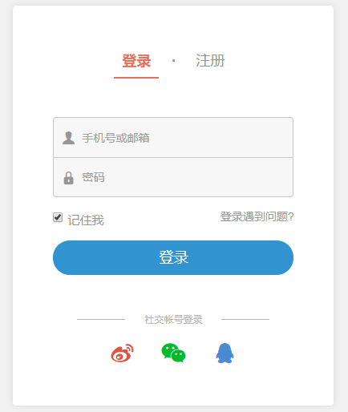

## 作业：

####  参考网址 https://www.jianshu.com/sign_in




#### 作业要求

 **1. 使用本模块内容，将简书登录框封装成一个登录，注册组件**

 **2. 注册接口验证 api  https://conduit.productionready.io/users**

 请求方式 post

 注册字段 

```json
{
  "user":{   
    	"username": "Jacob",
    	"email": "jake@jake.jake",
    	"password": "jakejake"
   }
}
```

 **3. 登录接口验证api https://conduit.productionready.io/users/login**

请求方式 post

请求字段

```json
{
	"user":{    
    "email": "jake@jake.jake",   
    "password": "jakejake"
   }
}
```